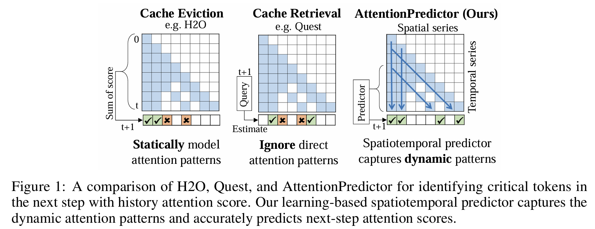

# AttentionPredictor: Temporal Pattern Matters for Efficient LLM Inference


Official implementation of **AttentionPredictor** - the first time series prediction of attention score for kv cache compression and learnable attention acceleration approach, which learns a lightweight convolution model to capture spatiotemporal patterns and predict the next-token attention score. An appealing feature is that it accurately predicts the attention score while consuming negligible memory. By retaining most of the attention information, AttentionPredictor achieves 16× KV cache compression with comparable LLM performance, significantly outperforming the state-of-the-art.

Our paper is on [https://arxiv.org/abs/2502.04077](https://arxiv.org/abs/2502.04077)

## Quick Start

### Requirements
- Torchs
- FlashAttention-2
- Transformers >= 4.44.0

### Supported LLMs
- LongChat: [lmsys/longchat-7b-v1.5-32k](https://huggingface.co/lmsys/longchat-7b-v1.5-32k)
- LLaMA-3.1: [meta-llama/Meta-Llama-3.1-8B-Instruct](https://huggingface.co/meta-llama/Meta-Llama-3.1-8B-Instruct)

## AttentionPredictor

The implementation of AttentionPredictor is in `src/llama_attention/attnpred_llama_attention.py`.

The pretrained predictor models are in `model/`.

## Experiments
To evaluate LongBench dataset:
```bash
cd src/evaluation/LongBench
bash eval.sh
bash metrics.sh
```

## Citation

If you find AttentionPredictor useful or relevant to your project and research, please kindly cite our paper:

```bibtex
@article{yang2024attentionpredictor,
    title={AttentionPredictor: Temporal Pattern Matters for Efficient LLM Inference},
    author={Yang, Qingyue and Wang, Jie and Li, Xing and Wang, Zhihai and Chen, Chen and Chen, Lei and Yu, Xianzhi and Liu, Wulong and Hao, Jianye and Yuan, Mingxuan and others},
    journal={arXiv preprint arXiv:2502.04077},
    year={2025}
}
```


